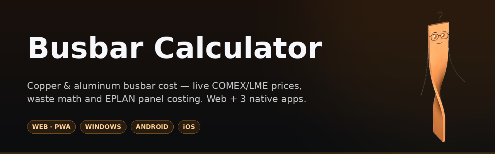
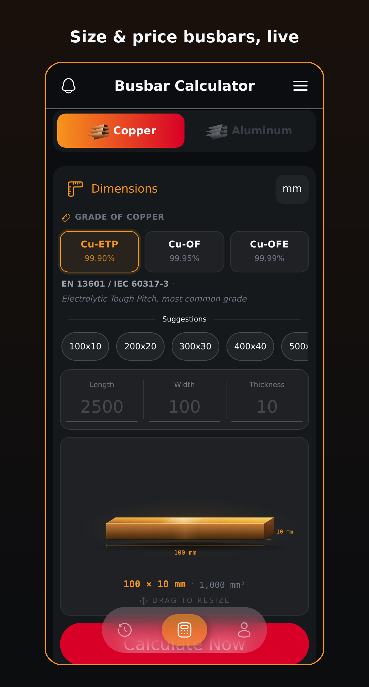
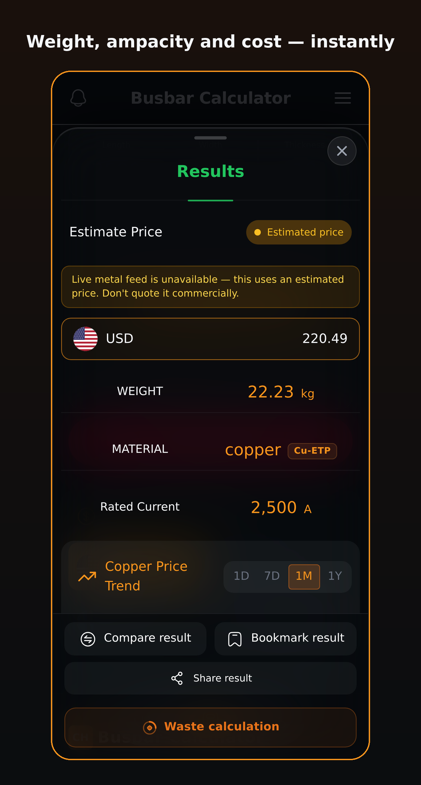
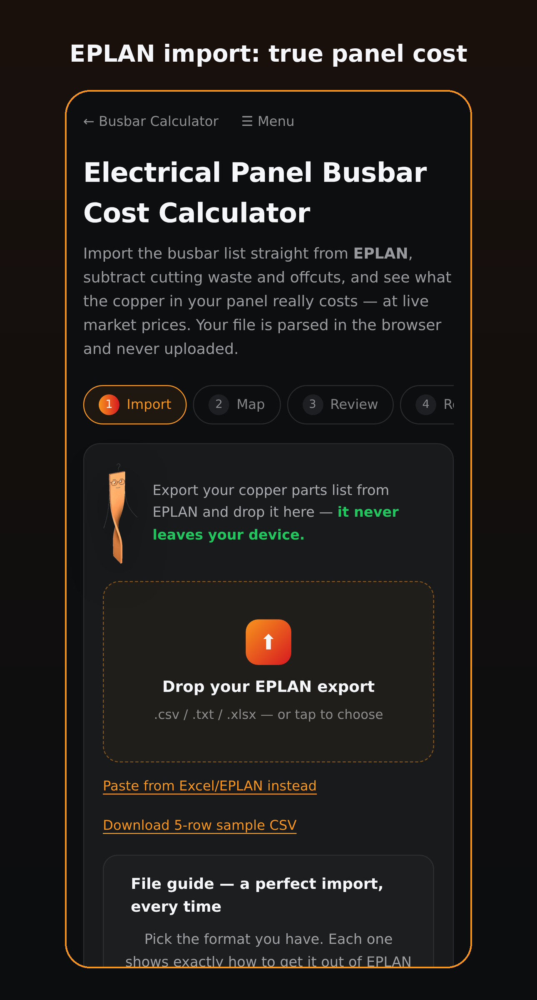
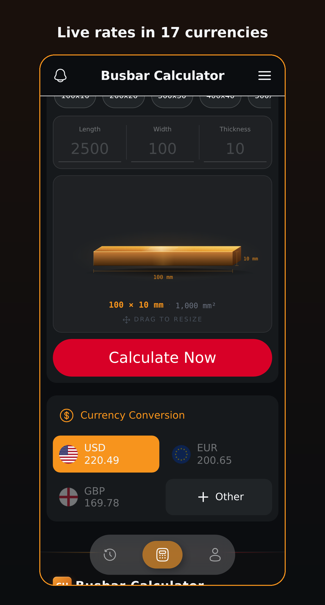
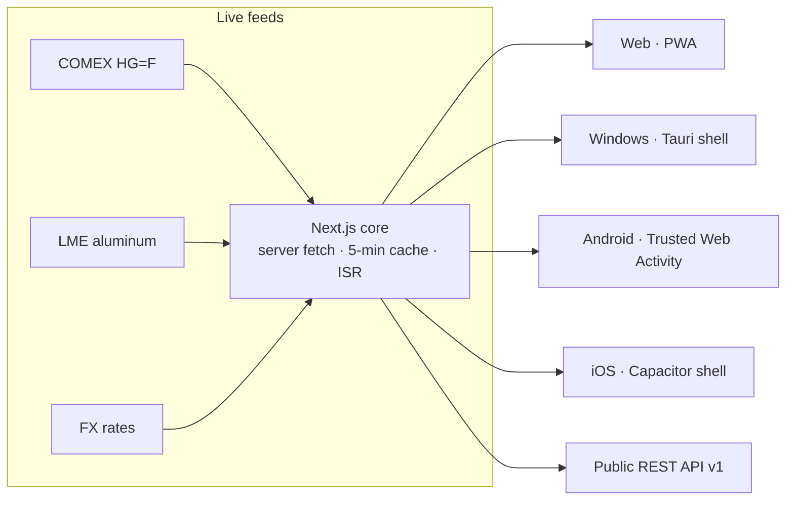

<div align="center">



**Professional copper & aluminum busbar costing — live COMEX/LME prices, waste math and EPLAN panel costing, on the web and as official Windows, Android and iOS apps.**

[](https://github.com/PAYAPRESS-prog/payapresswebapp/actions/workflows/ci.yml)
[](https://github.com/PAYAPRESS-prog/payapresswebapp/actions/workflows/release-windows.yml)
[](https://github.com/PAYAPRESS-prog/payapresswebapp/actions/workflows/release-android.yml)
[](https://github.com/PAYAPRESS-prog/payapresswebapp/actions/workflows/release-ios.yml)

[](https://github.com/PAYAPRESS-prog/payapresswebapp/releases/tag/desktop-v1.0.2)
[](https://github.com/PAYAPRESS-prog/payapresswebapp/releases/tag/android-v1.0.1)
[](ios/README-IOS.md)
[](LICENSE)
[](CONTRIBUTING.md)

[](https://nextjs.org)
[](https://react.dev)
[](https://www.typescriptlang.org)
[](https://tailwindcss.com)
[](desktop/README-DESKTOP.md)
[](ios/README-IOS.md)

**[▶ Live App](https://calculator.payapress.com)** · **[⬇ Downloads](https://calculator.payapress.com/download)** · **[API Reference](docs/API.md)** · **[Architecture](docs/architecture.md)** · **[Whitepaper](https://calculator.payapress.com/whitepaper)** · **[Roadmap](https://calculator.payapress.com/roadmap)**

</div>

---

## Get the app

| Platform | Download | Notes |
|---|---|---|
| 🌐 **Web / PWA** | [calculator.payapress.com](https://calculator.payapress.com/busbar-calculator) | Installs to any home screen, offline-aware |
| 🖥️ **Windows 10/11** | [x64 installer](https://github.com/PAYAPRESS-prog/payapresswebapp/releases/download/desktop-v1.0.2/Busbar-Calculator-Setup-x64.exe) · [ARM64](https://github.com/PAYAPRESS-prog/payapresswebapp/releases/download/desktop-v1.0.2/Busbar-Calculator-Setup-arm64.exe) · [MSI](https://github.com/PAYAPRESS-prog/payapresswebapp/releases/download/desktop-v1.0.2/Busbar-Calculator-x64.msi) | ~1.5 MB Tauri shell, SHA-256 published |
| 🤖 **Android 7+** | [APK](https://github.com/PAYAPRESS-prog/payapresswebapp/releases/download/android-v1.0.1/Busbar-Calculator.apk) | Signed Trusted Web Activity · Google Play listing in progress |
| 🍎 **iOS 15+** | TestFlight / App Store — coming soon | Capacitor shell with Sign in with Apple, [built & CI-verified](ios/README-IOS.md) |

The [/download](https://calculator.payapress.com/download) page always points at the newest release of every platform.

## Screenshots

Real product screens (from the store listing set):

| | |
|---|---|
|  |  |
|  |  |

## Features

- **Live market pricing** — COMEX HG=F copper and LME aluminum, fetched server-side with a 5-minute cache and an explicit *Estimated price* fallback badge when a feed stalls
- **Busbar engine** — weight, ampacity and cost from exact dimensions; IEC standard cross-sections; Cu-ETP / Cu-OF / Cu-OFE and aluminum grades with exact densities; drag-to-resize 3D busbar viewer
- **17 currencies** with live FX conversion, custom currencies and manual-rate mode
- **Waste calculator** — blade kerf per cut `max(0.5 mm, Ø × 1.5%)` and punch-out slugs, weighed and priced at the live rate
- **EPLAN panel costing** — import the parts-list export from EPLAN (Excel or delimited text, German/English headers, German decimals, UTF-16), automatic column mapping with an import audit that explains and fixes issues, first-fit-decreasing offcut packing — **files are parsed in the browser and never uploaded**
- **Accounts & sync** — email OTP, Google Sign-In and a ready Sign-in-with-Apple path; saved history, compare, bookmarks; one account across all platforms; in-app account deletion
- **Daily price digest** email with your saved configurations re-priced
- **Four platforms, one core** — every web deploy is instantly an app update on Windows (Tauri), Android (TWA) and iOS (Capacitor)
- **Public REST API v1** — free calculation and live-price endpoints ([docs](docs/API.md)); `/embed` route + WordPress shortcode plugin
- **Privacy-first** — first-party cookieless analytics, no trackers, no ad identifiers; in-app micro-surveys (Pulse) instead of third-party tools

## Architecture



One live Next.js application (custom Node server on Hostinger + Passenger) serves the product; the three native shells wrap the same origin with platform integration — deep links, offline bootstraps, store-grade signing. Details in [docs/architecture.md](docs/architecture.md).

## Monorepo map

| Path | What lives there |
|---|---|
| `src/` | Next.js 15 app — pages, API routes, calculator engine, EPLAN importer, admin, Pulse |
| `desktop/` | Windows app (Tauri 2) — [release guide](desktop/README-DESKTOP.md) |
| `android/` | Android app (TWA) + Play Store kit — [release guide](android/README-ANDROID.md) |
| `ios/` | iOS app (Capacitor 7) + App Store kit — [release guide](ios/README-IOS.md) |
| `docs/` | [API](docs/API.md) · [architecture](docs/architecture.md) · media assets |
| `.github/workflows/` | CI + Windows/Android/iOS release pipelines |

## Quick start (development)

```bash
git clone https://github.com/PAYAPRESS-prog/payapresswebapp.git
cd payapresswebapp
npm install
npm run dev        # http://localhost:3000
npm run build      # production build
npm test           # unit tests
npm run test:smoke # component smoke tests
```

Optional environment variables (values live only in the hosting panel — never in the repo):

| Variable | Purpose |
|---|---|
| `DB_HOST` `DB_PORT` `DB_USER` `DB_PASSWORD` `DB_NAME` | MySQL for accounts/history |
| `JWT_SECRET` | Session signing (≥16 chars) |
| `SMTP_HOST` `SMTP_PORT` `SMTP_USER` `SMTP_PASS` `SMTP_FROM` | Transactional email |
| `NEXT_PUBLIC_GOOGLE_CLIENT_ID` | Google Sign-In |
| `APPLE_TEAM_ID` `APPLE_CLIENT_ID` `NEXT_PUBLIC_APPLE_CLIENT_ID` | Sign in with Apple / universal links |
| `ADMIN_KEY` | Back-office access |

The calculator itself runs with **zero** configuration — accounts, email and admin simply stay dormant.

Releases are cut per platform with tags `desktop-v*`, `android-v*`, `ios-v*` — see each platform README for the exact steps.

## Documentation

[API Reference](docs/API.md) · [Architecture](docs/architecture.md) · [Whitepaper](https://calculator.payapress.com/whitepaper) · [Roadmap](https://calculator.payapress.com/roadmap) · [Changelog](CHANGELOG.md) · [Contributing](CONTRIBUTING.md) · [Security policy](SECURITY.md)

## License

[MIT](LICENSE) © 2026 [payapress.com](https://www.payapress.com)

<div align="center">
<sub>Built with ❤️ by the Busbar team — say hi to Mr&nbsp;Busbar in the app.</sub>
</div>
